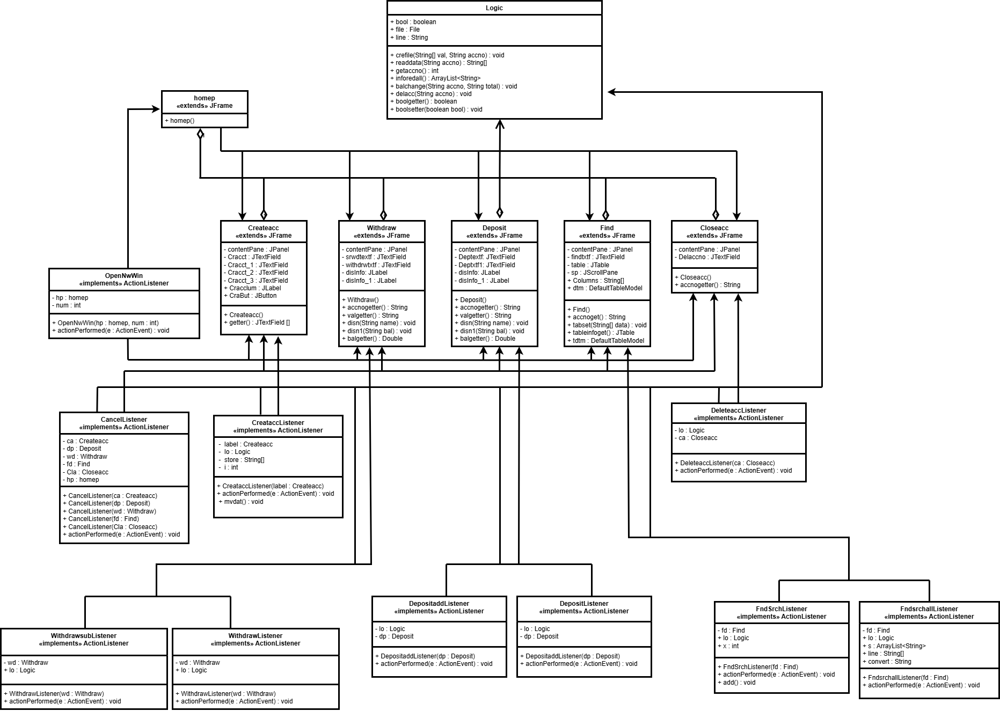

# Banking Application (Java Swing)

A simple banking management application built using Java Swing. The program demonstrates essential concepts of object-oriented programming, GUI development, event handling, and file handling.

## 1. Introduction

This project provides a basic banking system with the ability to create accounts, search for accounts, deposit money, withdraw money, and close accounts. All account data is stored in a file so that information persists even after the program closes.

## 2. Features

- Automatically generated account numbers  
- Find account functionality  
- Deposit and withdraw operations  
- View all accounts in a table  
- Permanently delete accounts  
- File-based data persistence  
- Clean structure with separate GUI, listener, and logic classes  

## 3. UML Diagram

Below is the full UML diagram representing the structure of the entire banking system:

## 4. System Structure Overview

- Each window is implemented as its own Swing class (`JFrame`).  
- Each button action is handled by a dedicated listener class (`ActionListener`).  
- The `Logic` class manages core functionality, including:  
  - Creating accounts  
  - Searching and retrieving data  
  - Deposits and withdrawals  
  - File storage and updates  
  - Account deletion  

This architecture ensures clean separation of concerns and easier maintainability.

## 5. Running the Application

1. Import the project into any Java IDE (Eclipse, IntelliJ, or VS Code).  
2. Ensure JDK (Java 8 or later) is installed.  
3. Run the main menu class to launch the application.

## 6. Conclusion

This project demonstrates a functional banking system using Java Swing with proper modular design.  
It showcases GUI development, event-driven programming, file handling, and multi-class organization.

